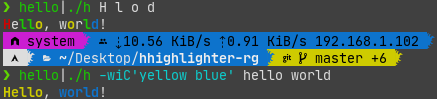

# hhighlighter-rg

Another hhighlighter, but this use rg.



## Usage

```shell
$ ./h
Usage: PROGRAM | h [OPTS] ARGS...

    Options from rg (ripgrep):
    -i                     search case-insensitively
    -w                     only show matches surrounded by word boundaries
    -F                     treat pattern as literal string
    -P                     enable matching with PCRE2

    -C COLOR_FORMAT        highlight color format
    -n                     dry run
    -h                     print this help message
    -V                     print version information
```

## Dependence

- [bash](https://www.gnu.org/software/bash/)
- [GNU coreutils](https://www.gnu.org/software/coreutils/)
- [ripgrep](https://github.com/BurntSushi/ripgrep/)

## TODO

- Add completions for zsh.

## Similar Project

- [hhighlighter](https://github.com/EliverLara/hhighlighter/) dependent on
[ack](http://betterthangrep.com)
